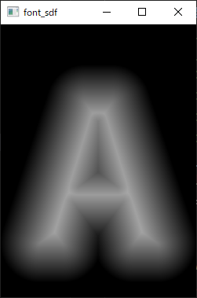
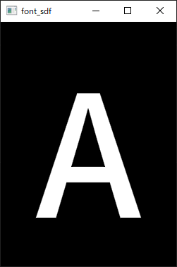

# opengl_sdf_font_rendering
Tiny example of rendering font (```.ttf```, ```.otf```) as SDF using OpenGL

## Overview
In this example, the approach is to [detect the edge path](https://github.com/fonttools/fonttools/blob/main/Lib/fontTools/ttLib/removeOverlaps.py) of the font and [fill by distance](https://www.shadertoy.com/view/dls3Wr).
<table>
    <tr>
        <th scope="col">
        </img>
        </th>
        <th scope="col">
        </img>
        </th>
    </tr>
    <tr>
        <th scope="col">
        BLUR: 100, EXPAND: 50
        </th>
        <th scope="col">
        BLUR: 0, EXPAND: 0
        </th>
    </tr>
</table>

```glsl
// shader code: ./shaders/font.frag

#define BLUR (...)
#define EXPAND (...)

// (get distance from shape ...)

// (render with distance ...)
dist *= winding;
float delta = fwidth(dist) * 0.5;
float alpha = 1-smoothstep(-delta + EXPAND - BLUR, delta + EXPAND, dist);
out_color = vec4(alpha, alpha, alpha, alpha);
```

## Operating Environment
|        |          |
| ------ | -------- |
| OS     | Windows  |
| Python | 3.11     |
| IDE    | anaconda |

## Dependencies
- [PyOpenGL](https://pypi.org/project/PyOpenGL/)
- [glfw](https://pypi.org/project/glfw/)
- [matplotlib](https://pypi.org/project/matplotlib/)
- [numpy](https://pypi.org/project/numpy/)
- [fonttools](https://pypi.org/project/fonttools/)
- [skia-pathops](https://pypi.org/project/skia-pathops/)

## Getting started
- Clone the repository with the following command
```cmd
git clone https://github.com/TLabAltoh/opengl_sdf_font_rendering.git
```
- Run ```main.py``` with the following command
```cmd
cd opengl_sdf_font_rendering

python main.py %{FONT_PATH} %{CHAR} %{FONT_SIZE}
@rem ex. python main.py font.ttf A 35
```
